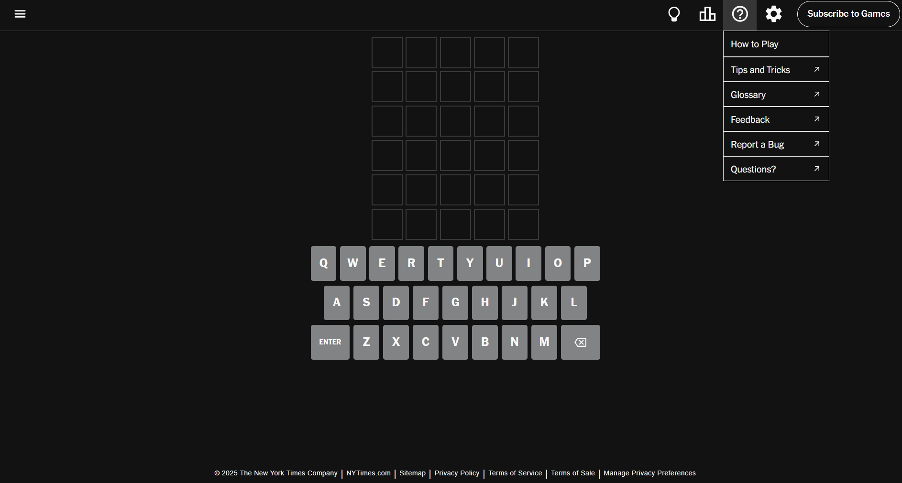
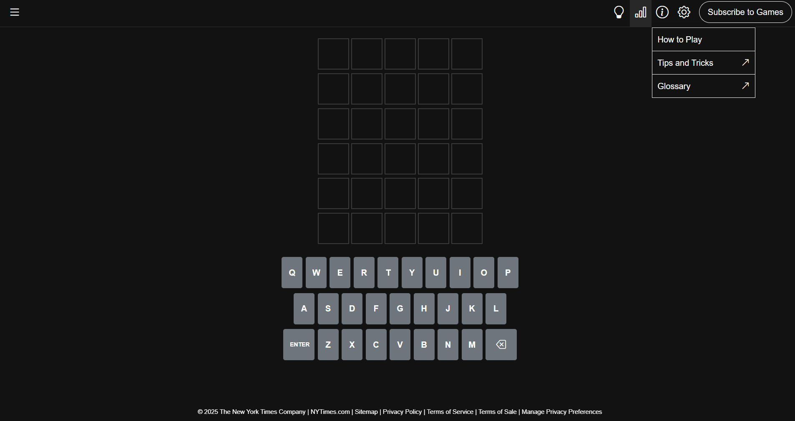

# UI Frameworks: From Complexity to Creative Efficiency

UI frameworks can seem intimidating at first, almost like learning a whole new programming language. But once you get past the initial learning curve, they become powerful tools that save time and reduce repetitive work. In my journey with Bootstrap 5, I discovered that the benefits far outweigh the initial hassle.

## Discovering Bootstrap 5

My first encounter with a UI framework was with Bootstrap 5. At first, the extensive documentation felt overwhelming. I spent hours scrolling through pages of icons, containers, and navbars just to figure out what I needed. Despite the steep learning curve, the experience was ultimately very rewarding.

One of the best features I found was the live preview in VSCode. Being able to see my changes instantly made a huge difference. It transformed the process of adjusting elements into an interactive experience, which is something you just can’t get when writing raw HTML and CSS from scratch.

## The Power of Pre-Built Components

Bootstrap 5 takes care of much of the repetitive styling work that usually clutters your CSS files. With a well-defined grid system and a variety of pre-built components, I was able to assemble a responsive, modern-looking page in a fraction of the time it would have taken if I had started from scratch. This efficiency is especially noticeable when I compare it to manually coding every single style detail.

Here’s a snippet that shows how effortlessly you can create a responsive layout with Bootstrap:

```html
<div class="container">
  <div class="row">
    <div class="col-md-4">Column 1</div>
    <div class="col-md-4">Column 2</div>
    <div class="col-md-4">Column 3</div>
  </div>
</div>
```

This simple code quickly sets up a three-column layout that adjusts seamlessly across different screen sizes.

## Bringing Ideas to Life

To put Bootstrap 5 to the test, I created an imitation of the popular Wordle page. This project allowed me to explore the framework’s capabilities and see how quickly I could build a polished, responsive design. The results were impressive: consistent spacing, clean alignment, and a professional look that would have taken much longer to achieve with custom HTML and CSS alone.

**Figure:** Right: Real Wordle page | Left: My imitation created using Bootstrap 5
<div style="display: flex; justify-content: center; gap: 20px;">
    <figure>
        
    </figure>
    <figure>
        
    </figure>
</div>

## Why Invest the Time?

The initial effort required to learn a UI framework like Bootstrap 5 is certainly non-trivial. However, the long-term benefits make it a worthwhile investment. By mastering Bootstrap, you can significantly speed up prototyping and development. You spend less time wrestling with styling details and more time focusing on functionality and creative design.

Moreover, Bootstrap’s robust community support and comprehensive documentation make it easier to troubleshoot issues and find inspiration. It’s like having a toolkit that grows with you as you become a more proficient developer.

## Final Thoughts

Overall, my experience with Bootstrap 5 has been incredibly positive. Despite the time spent poring over documentation and figuring out the nuances of its classes, I’ve found that the framework greatly enhances my productivity and creativity. It’s a great tool for UI design, and when paired with technologies like React, it can power some truly dynamic and responsive applications.

For anyone considering diving into UI frameworks, my advice is to embrace the learning curve. The initial frustration is quickly replaced by the satisfaction of seeing your ideas come to life with efficiency and style.

